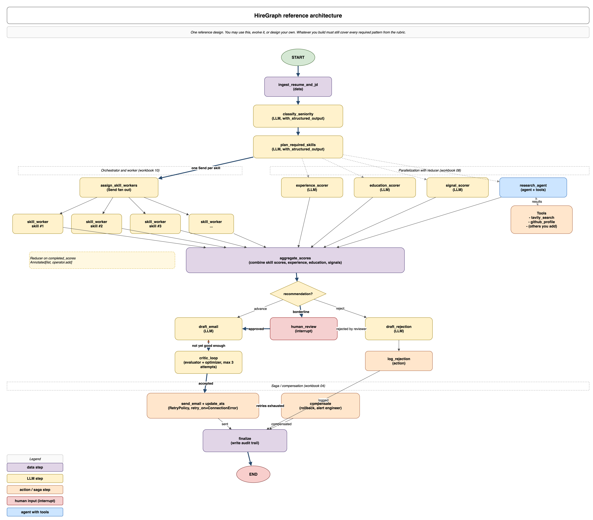

# Agent Builder Assignment 2

> A LangGraph-based smart hiring assistant. Build it end to end and demo it in class.

This is the second assignment for the Agent Builder course. You will design and ship a real LangGraph application that exercises every concept from Class 2: state design, routing, parallelization, orchestrator and worker, evaluator and optimizer, agents with tools, retries, human in the loop, and the saga pattern.

You will deliver this as a GitHub repository with a CLI, a small web UI, a Jupyter notebook walkthrough, and a short in-class presentation.

## Quick links

| Document | Purpose |
| :--- | :--- |
| [`README.md`](README.md) | Problem statement and deliverables (this file) |
| [`RUBRIC.md`](RUBRIC.md) | Grading rubric, 100 points |
| [`RESOURCES.md`](RESOURCES.md) | Free APIs, mocks, and wiring snippets |
| [`STARTER_HINTS.md`](STARTER_HINTS.md) | Suggested schemas and graph shapes (read after Day 3) |
| [`SUBMISSION_CHECKLIST.md`](SUBMISSION_CHECKLIST.md) | The boxes the grader will tick |
| [`sample_data/`](sample_data/) | Job descriptions and resumes to test against |

## Table of contents

1. [Business problem](#1-business-problem)
2. [What you will build](#2-what-you-will-build)
3. [Reference architecture](#3-reference-architecture)
4. [Deliverables](#4-deliverables)
5. [Required patterns](#5-required-patterns)
6. [Recommended free APIs](#6-recommended-free-apis)
7. [Constraints](#7-constraints)
8. [Sample data](#8-sample-data)
9. [Suggested timeline](#9-suggested-timeline)
10. [How you will be graded](#10-how-you-will-be-graded)
11. [Submission](#11-submission)

## 1. Business problem

Recruiting teams drown in resumes. A senior recruiter at a 200 person company may receive 400 applications for a single backend role, of which roughly 40 are worth a closer look. They want an assistant that:

1. Reads the resume and the job description.
2. Decides whether the candidate is roughly junior, mid, senior, or executive level.
3. Scores the candidate across multiple independent dimensions such as skills, experience, education, and public signals (GitHub, publications).
4. Produces an explainable scorecard.
5. Drafts a personalised email back to the candidate (advance, reject, or "we'd like to talk").
6. Lets a human reviewer approve, edit, or reject the draft before it goes out.
7. Logs the decision into the ATS and rolls back cleanly if any downstream step fails.

Your job is to build this assistant as a LangGraph application.

## 2. What you will build

A Python application called **HireGraph** (you may rename it) that:

* Loads a resume and a JD from disk or HTTP.
* Runs them through a LangGraph graph you design.
* Returns a `Decision` object containing:
  * A structured *scorecard* with sub-scores per dimension.
  * A *recommendation* of `advance`, `reject`, or `borderline`.
  * A polished *email draft* to the candidate.
  * An *audit trail* listing every node executed, the verdict, and the time taken.

The graph **must** include every pattern listed in [Section 5](#5-required-patterns). The graph **must** be built with LangGraph.

## 3. Reference architecture

The diagram below is one valid HireGraph design. You may use it as-is, evolve it, or design your own. Whatever you build must still cover every pattern in the [required patterns](#5-required-patterns) table.



A few things to notice about this reference design:

* The orchestrator and worker band on the left fans out one worker per required skill listed in the JD.
* The parallel scorers on the right run independently and merge their outputs into the same state key using a reducer.
* The decision node routes to one of three branches: `advance`, `borderline`, or `reject`. Only the borderline branch pauses for human review.
* The critic loop sits between drafting and sending; it bounds itself with an attempt counter.
* The saga band at the bottom guarantees every run reaches a terminal `END` state, whether the email was sent, compensated, or simply logged.

The editable source is at `docs/architecture/hiregraph_architecture.drawio`. Open it in [diagrams.net](https://app.diagrams.net) if you want to remix it for your own design write-up.

## 4. Deliverables

Submit a public (or private and shared) GitHub repository. The layout below is suggested. The contents are required.

```
hiregraph/
  README.md                  Setup, design decisions, screenshots, demo gif
  pyproject.toml             uv project file with pinned versions
  .env.example               All env vars the project reads
  main.py                    CLI entry point that runs the canned scenarios
  src/hiregraph/             Multi-file Python package
  api/                       Optional FastAPI server (recommended)
  ui/                        Minimal web UI
  notebooks/walkthrough.ipynb  Notebook explaining the graph and demoing runs
  tests/                     pytest tests for at least three nodes
  graph_out/                 Committed PNG of the compiled graph
  presentation/              Slides for the in-class demo
  sample_data/               Resumes and JDs (we ship some)
```

You may vibecode the UI with Claude Code, Cursor, v0, Lovable, or any tool you prefer. The UI is graded on whether a reviewer can demo your agent through it, not on visual polish.

### Required behaviour at runtime

When `uv run python main.py` is executed on a fresh clone with an LLM API key set, the project must:

1. Compile the graph and write `graph_out/graph.png`.
2. Run three scenarios end to end:
   * A clearly strong candidate. The graph should not pause for review.
   * A clearly weak candidate. The graph should reject without pause.
   * A borderline candidate. The graph **must** pause at `interrupt()`. Your `main.py` should auto-approve to keep the demo end to end.
3. Print a scoreboard summary listing all three results.

## 5. Required patterns

Your graph **must** demonstrably implement every row in the table below. The grader will ask you to point at the node, the line, or the edge during the demo. The right-hand column points back to the relevant Class 2 workbook.

| Pattern | What it must do | Workbook |
| :--- | :--- | :---: |
| TypedDict state with raw data | One `HireGraphState` storing raw resume text, raw JD text, structured classification, raw scorecard, draft email, and audit trail | 02 |
| Node functions with `Command(goto=...)` | At least three nodes self route | 03 |
| `RetryPolicy` | Attached to at least two external-service nodes with `retry_on=` to narrow the blast radius | 04 |
| LLM-recoverable loopback | At least one tool or parser error becomes data in state and routes back to an LLM node that corrects itself | 04 |
| `interrupt()` plus checkpointer | Borderline candidates pause for human review and the same `thread_id` resumes cleanly | 04, 05 |
| Saga or compensation | If `update_ats` or `send_email` fails after retries, the graph routes to a compensation node, logs the failure, and reaches a clean terminal state | 04 |
| Structured output | At least one classification step uses `with_structured_output` with `Literal` or Pydantic | 06 |
| Tool calling | Your research agent binds tools and uses them | 06, 12 |
| Short-term memory or `MessagesState` | Multi-turn LLM exchanges preserve message history | 06, 12 |
| Prompt chaining | At least one sub-pipeline runs sequential LLM calls (parse resume, then normalise skills, then extract years of experience) | 07 |
| Parallelization with reducer | At least three scoring dimensions run in parallel and merge via a reducer | 08 |
| Routing | An LLM classifier decides seniority and routes to a seniority-specific scoring sub-graph | 09 |
| Orchestrator and worker with `Send` | The orchestrator plans one worker per required skill in the JD and fans them out via `Send(...)` | 10 |
| Evaluator and optimizer | A critic LLM grades the email draft; the loop retries up to N times then escalates to human review | 11 |
| Agent with tools and `ToolNode` | A `research_candidate` agent can call web search, GitHub lookup, or similar tools to enrich the profile | 12 |

## 6. Recommended free APIs

You are not required to spend money. Every external service below has a generous free tier or a sandbox. If you do not want to set up keys, the same project must still run with deterministic mocks in `src/hiregraph/services.py`. A `HIREGRAPH_USE_MOCKS=true` env flag toggles between the two.

| Purpose | Recommended free service | Notes |
| :--- | :--- | :--- |
| LLM | OpenAI `gpt-4o-mini` or Anthropic `claude-3-5-haiku` | Both are cheap. A full demo run costs a few cents. |
| Web search | Tavily, free tier (1000 searches per month) | Used by the research agent to look up company info or candidate's public work |
| GitHub profile | GitHub REST API, public reads work without auth for low volumes | Fetch repos count, languages, recent activity. Add a token for higher limits. |
| Email send | Mailtrap or Ethereal Email, both free | Sandbox inbox, never reaches the candidate |
| Observability | LangSmith free tier | Recommended. Share trace links in your README. |
| Resume parsing | PyMuPDF for PDF to text | Resumes as markdown or text are simpler |

If you skip an API, replace its node with a deterministic mock and document the trade off in your README in one sentence. You do not lose points for using mocks. You earn bonus points for cleanly wiring real APIs.

## 7. Constraints

* **LangGraph is required.** Do not solve this with LangChain expression language alone, with `asyncio.gather`, or with a custom orchestrator. The point of this assignment is to practise LangGraph.
* **Python 3.11 or newer** and **uv** for dependency management.
* **No prompts in state.** State holds raw data. Prompts are built inside nodes (workbook 02 rule).
* **Type-annotated `Command` returns.** Every routing node has a `Command[Literal["...", "..."]]` annotation so the graph visualises correctly.
* **No em dashes.** Match the course style.
* **Tests.** At least one unit test per category: a state test, a node test with the LLM mocked, and an end-to-end test that uses the in-memory checkpointer with one borderline scenario.

## 8. Sample data

We ship two JDs and three resumes under `sample_data/`. Use them. Add more if you want. Your demo run must include at least our three resumes against at least one of our JDs.

| File | Description |
| :--- | :--- |
| `sample_data/jds/jd_senior_backend.md` | Senior backend engineer role |
| `sample_data/jds/jd_junior_data.md` | Junior data analyst role |
| `sample_data/resumes/resume_priya.md` | Strong senior backend candidate |
| `sample_data/resumes/resume_eitan.md` | Mid-level with potential, borderline for senior role |
| `sample_data/resumes/resume_mira.md` | Mismatch (frontend heavy) for the backend role |
| `sample_data/expected_outcomes.md` | A truth table you can self-grade against |

## 9. Suggested timeline

| Day | Goal |
| :---: | :--- |
| 1 | Read this brief twice. Sketch your state and your graph on paper. Decide which patterns live where. |
| 2 | State and nodes for ingest, classify, parallel scoring. Compile and run with stubs. |
| 3 | Orchestrator and worker per skill. Reducer on `completed_scores`. |
| 4 | Evaluator and optimizer loop on the email draft. `interrupt()` for borderline cases. |
| 5 | Saga path for `send_email` and `update_ats`. Tests. |
| 6 | UI, notebook walkthrough, slides. |
| 7 | Polish, README, commit, push, submit link. |

## 10. How you will be graded

See [`RUBRIC.md`](RUBRIC.md) for the full point breakdown. Headline: 100 points total, 50 of which are pattern coverage and LangGraph correctness. The rest are code quality, tests, UI, docs, and presentation.

## 11. Submission

1. Push your repository (public, or private and shared with the instructor).
2. Tag the submission commit `v1.0`.
3. Open an issue titled `Submission: <your name>` containing:
   * Link to the tagged commit.
   * Link to a LangSmith trace of one full run (if you used LangSmith).
   * One paragraph: what you learned and what surprised you.
4. Be ready to demo for 10 minutes in the next class.

Good luck. If you get stuck, re-read workbook 01 first, then ask in the course channel.
